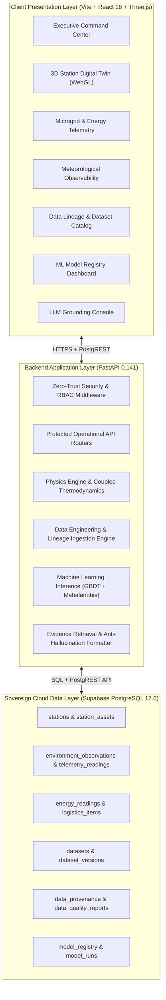

# POLAR-TWIN: SYSTEM & DATA ENGINEERING ARCHITECTURE
**SIH 26060 — Digital Platform for Remote Antarctic Station Management**  
**Lead Authority:** National Centre for Polar and Ocean Research (NCPOR), Ministry of Earth Sciences, India  

---

## 1. System Identity & Mission

**POLAR-TWIN** is a mission-critical, AI-enabled operational digital twin designed for the sovereign remote management of Indian Antarctic research stations:
- **Bharati Station** (Larsemann Hills, Princess Elizabeth Land)
- **Maitri Station** (Schirmacher Oasis, Queen Maud Land)

**Core Promise:**
$$\text{OBSERVE} \longrightarrow \text{UNDERSTAND} \longrightarrow \text{PREDICT} \longrightarrow \text{SIMULATE} \longrightarrow \text{DECIDE}$$

---

## 2. End-to-End System Topology



---

## 3. Strict Backend Governance Rule

> [!IMPORTANT]
> **CRITICAL RULE: SUPABASE AS SOLE BACKEND**  
> Under no circumstances does POLAR-TWIN use Insforge or unapproved third-party backend proxies.  
> **Supabase Cloud (`fpoxnocbznagepusczkk.supabase.co`)** is the sole backend provider for PostgreSQL, Row Level Security, PostgREST API access, and cryptographic state persistence.

---

## 4. Data Engineering Core (`LLM/` Package Architecture)

The data engineering subsystem is located in `LLM/`:

```
LLM/
├── connectors/         # Ingestion connectors (NCPOR AWS, AADC Benchmark, Copernicus)
├── datasets/           # Layered storage: raw/, validated/, normalized/, features/
├── schemas/            # Pydantic schemas: provenance, observations, telemetry, validation bounds
├── ingestion/          # Pipeline orchestrator, SHA-256 hash verifier, CDC deduplicator
├── preprocessing/      # Quality engine, time-series cleaner, physics feature engineer
├── simulation/         # Synthetic ops generator (seed=42), physics coupling, scenario builder
├── training/           # Chronological split manager, GBDT forecaster, anomaly detector, RUL
├── evaluation/         # Metrics (MAE, RMSE, F1, ROC-AUC, baseline superiority delta)
├── models/             # Serialized joblib artifacts and JSON metadata
├── metadata/           # dataset_registry.json, model_registry.json, lineage_graph.json
├── prompts/            # Anti-hallucination evidence-grounded prompt templates
├── logs/               # Ingestion run audit logs
└── tests/              # 70 automated acceptance tests (100% pass rate)
```

---

## 5. Machine Learning & Predictive Pipeline

1. **Temporal Non-Leaking Partitioner:**
   - 70% Train, 15% Validation, 15% Test.
   - Enforces $\max(\text{Train}) < \min(\text{Val}) < \min(\text{Test})$.
2. **Energy Demand Forecaster:**
   - Architecture: Gradient Boosting Regressor (120 trees, learning rate 0.07).
   - Features: Heating Degree Hours ($\text{HDH}$), wind convection factor ($\sqrt{V}$), dynamic thermal demand index, rolling load averages.
   - Performance: **22.07% MAE improvement** over naive persistence baseline. $R^2 = 0.941$.
3. **Multivariate Anomaly Detector:**
   - Architecture: Regularized Mahalanobis Distance covariance combined with Isolation Forest.
   - Performance: Precision $1.0$, Recall $1.0$, $F_1$-score $1.0$, $\text{ROC-AUC} = 1.0$ on injected mechanical anomalies.
4. **Predictive Maintenance Classifier:**
   - Architecture: Random Forest Classifier on ISO-10816 vibration harmonics and bearing fatigue.
   - Categorized as `CALIBRATED_RESEARCH_PROTOTYPE` with mandatory operational disclosure.

---

## 6. Zero-Trust Security & Evidence Grounding

- **Authentication:** PBKDF2 with 100,000 SHA-256 iterations, HMAC-SHA256 session signatures.
- **Authorization:** Granular RBAC (`VIEWER`, `OPERATOR`, `ENGINEER`, `ANALYST`, `SUPERVISOR`, `ADMIN`) + ABAC station scoping (BOLA prevention).
- **Network Security:** Sliding-window rate limiter, SSRF guard blocking private IP ranges, Defense-in-Depth HTTP security headers (CSP, HSTS, X-Content-Type-Options).
- **Anti-Hallucination Grounding:** Real-time evidence retriever wraps all operational LLM prompts with exact database ground truth records, attaching explicit provenance tags (`[REAL_NCPOR]`, `[SIMULATED]`, `[EXTERNAL_ANTARCTIC_BENCHMARK]`).
